<div align="center">
  


<p align="center">
  <a href="#-features"></a> •
  <a href="#-live-demo"></a> •
  <a href="#-screenshots"></a> 
</p>


[](https://feeza-portfolio.vercel.app)
[](https://reactjs.org)
[](https://greensock.com/gsap/)
[](https://developer.mozilla.org/en-US/docs/Web/JavaScript)

<p align="center">
  
</p>

</div>

---

## 📋 Table of Contents

<div align="center">

| Section | Description |
|---------|-------------|
| [✨ Features](#-features) | Key functionalities and highlights |
| [🚀 Live Demo](#-live-demo) | See it in action |
| [📸 Screenshots](#-screenshots) | Visual preview |
| [⚙️ Tech Stack](#️-tech-stack) | Technologies used |
| [📦 Installation](#-installation) | Setup guide |
| [📁 Project Structure](#-project-structure) | File organization |
| [📄 License](#-license) | MIT License |

</div>

---

## ✨ Features

```mermaid
mindmap
  root((✨ FEEZA's PORTFOLIO))
    🎨 DESIGN
      Dark Theme
      Gradient Effects
      Responsive Layout
      Custom Animations
    🧩 SECTIONS
      Home with Typewriter
      About with Skills
      Projects Grid
      Contact Form
    ⚡ INTERACTIVITY
      GSAP Animations
      Scroll Triggers
      Hover Effects
      Mobile Menu
    🔧 TECH
      React 18
      JavaScript ES6+
      CSS3 Modules
      Formspree Integration
```

<div align="center">



</div>

### 🎯 **Core Highlights**

| Feature | Description | Status |
|---------|-------------|--------|
| 🌓 **Dark Theme** | Modern dark UI with cyan/blue accents | ✅ |
| 📱 **Fully Responsive** | Mobile, tablet, desktop optimized | ✅ |
| ⚡ **GSAP Animations** | Smooth scroll-triggered animations | ✅ |
| ⌨️ **Typewriter Effect** | Dynamic text on homepage | ✅ |
| 🃏 **Interactive Cards** | Hover effects with tooltips | ✅ |
| 📧 **Working Contact Form** | Formspree integration | ✅ |
| 🍔 **Mobile Menu** | Animated hamburger menu | ✅ |
| 🔍 **SEO Optimized** | Meta tags for better visibility | ✅ |

---

## 🚀 Live Demo

<div align="center">

### 🌐 **Experience the portfolio live**


**👉 [https://feezakulsoom.github.io/feezakulsoom-portfolio](https://feezakulsoom.github.io/feezakulsoom-portfolio/)**

</div>

---

## 📸 Screenshots

<div align="center">

### 🏠 Home Section


</div>

---

## ⚙️ Tech Stack

<div align="center">

### 🚀 **Core Technologies**

<table align="center">
  <tr>
    <td align="center" width="120">
      
      <br><b>React 18</b>
      <br><sub>UI Library</sub>
    </td>
    <td align="center" width="120">
      
      <br><b>JavaScript</b>
      <br><sub>ES6+</sub>
    </td>
    <td align="center" width="120">
      
      <br><b>CSS3</b>
      <br><sub>Modules</sub>
    </td>
    <td align="center" width="120">
      
      <br><b>HTML5</b>
      <br><sub>Semantic</sub>
    </td>
  </tr>
</table>

### 📦 **Key Libraries & Tools**

| Category | Technologies |
|----------|--------------|
| 🎭 **Animations** | GSAP, ScrollTrigger, React Simple Typewriter |
| 🧭 **Navigation** | React Scroll, React Router |
| 📧 **Contact Form** | Formspree API |
| 🎨 **Icons & Assets** | Custom PNG assets |
| 🚀 **Deployment** | Github |
| 📊 **Performance** | Lighthouse |

</div>

---

## 📦 Installation

### 📋 **Prerequisites**

- Node.js (v14 or higher)
- npm or yarn
- Git

### ⚡ **Quick Setup**

```bash
# 1️⃣ Clone the repository
git clone https://github.com/feezakulsoom/portfolio.git

# 2️⃣ Navigate to project directory
cd portfolio

# 3️⃣ Install dependencies
npm install

# 4️⃣ Start development server
npm start

# 5️⃣ Build for production
npm run build
```

### 🔧 **Environment Variables**

Create a `.env` file in the root directory:

```env
REACT_APP_FORMSPREE_ENDPOINT=your_formspree_endpoint
```

---


## 📁 Project Structure

```
📦 portfolio/
├── 📂 public/
│   ├── 📄 index.html
│   ├── 🖼️ favicon.ico
│   └── 🖼️ og-image.jpg
├── 📂 src/
│   ├── 📂 assets/
│   │   ├── 🖼️ avatar.png
│   │   ├── 🖼️ contact.png
│   │   ├── 🖼️ js.png
│   │   ├── 🖼️ react.png
│   │   └── 🖼️ laptop.png
│   ├── 📂 components/
│   │   ├── 📂 Nav/
│   │   │   ├── 📄 Nav.jsx
│   │   │   └── 🎨 Nav.css
│   │   ├── 📂 Home/
│   │   │   ├── 📄 Home.jsx
│   │   │   └── 🎨 Home.css
│   │   ├── 📂 About/
│   │   │   ├── 📄 About.jsx
│   │   │   └── 🎨 About.css
│   │   ├── 📂 Projects/
│   │   │   ├── 📄 Projects.jsx
│   │   │   └── 🎨 Projects.css
│   │   ├── 📂 Contact/
│   │   │   ├── 📄 Contact.jsx
│   │   │   └── 🎨 Contact.css
│   │   └── 📂 Card/
│   │       ├── 📄 Card.jsx
│   │       └── 🎨 Card.css
│   ├── 📄 data.js
│   ├── 📄 App.js
│   ├── 🎨 App.css
│   └── 📄 index.js
├── 📄 package.json
├── 📄 README.md
└── 📄 .gitignore
```


---

## 📄 License

<div align="center">

MIT License © 2026 **Feeza Kulsoom**


### 🌟 **Show your support**

If you like this portfolio, please consider giving it a ⭐ on GitHub!

[](https://github.com/feezakulsoom/portfolio)
[](https://x.com/MalikFeeza62772)

---

### 📬 **Contact Me**

[](mailto:feezakulsoom42@gmail.com)
[](https://github.com/FEEZAKULSOOM)
[](https://linkedin.com/in/feezakulsoom)

---


</div>
